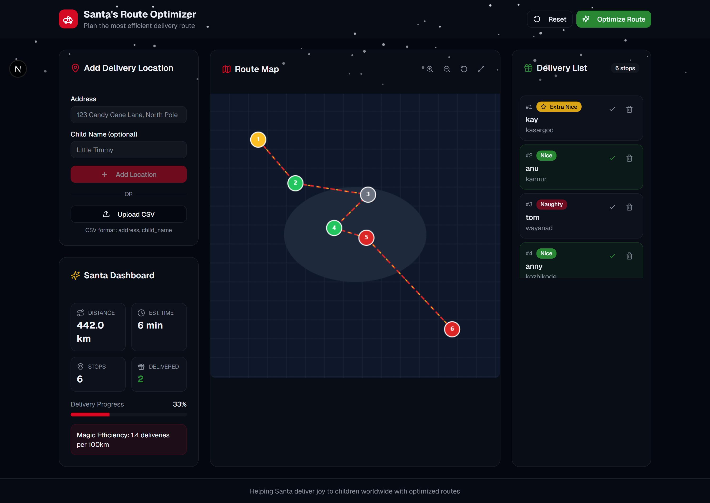
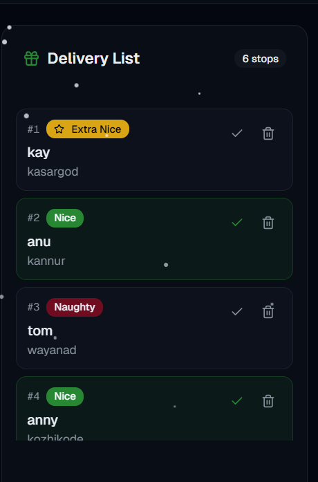

# Santa's Route Optimizer 🎅

A smart delivery route optimization app that helps Santa plan the most efficient path to deliver gifts worldwide. Built for hackathon submission.



## Features

- **Location Management** - Add delivery addresses manually or upload via CSV file
- **Geocoding** - Automatically converts addresses to coordinates using OpenStreetMap Nominatim API
- **Route Optimization** - Uses Nearest Neighbor TSP algorithm with 2-opt improvement for efficient routes
- **Interactive Map** - Visual canvas-based map with dragging, zooming, and route visualization
- **Santa Dashboard** - Real-time stats showing total distance, estimated travel time, and delivery progress
- **Delivery Tracking** - Mark deliveries as complete and track progress
- **Priority System** - Tag children as Nice, Naughty, or Extra-Nice for delivery prioritization
- **Christmas Theme** - Festive dark theme with animated snowfall effect

## Tech Stack

- **Framework**: Next.js 15 (App Router)
- **Language**: TypeScript
- **Styling**: Tailwind CSS v4
- **UI Components**: shadcn/ui
- **Map Rendering**: HTML Canvas API
- **Geocoding**: OpenStreetMap Nominatim API
- **Algorithm**: Traveling Salesman Problem (TSP) with Nearest Neighbor + 2-opt optimization

## Setup Instructions

### Prerequisites

- Node.js 18+ installed
- npm or yarn package manager

### Installation

1. Clone the repository:
   ```bash
   git clone https://github.com/yourusername/santa-route-optimizer.git
   cd santa-route-optimizer
   ```

2. Install dependencies:
   ```bash
   npm install
   ```

3. Run the development server:
   ```bash
   npm run dev
   ```

4. Open [http://localhost:3000](http://localhost:3000) in your browser

### Alternative: Using shadcn CLI

```bash
npx shadcn@latest add https://v0.dev/chat/your-project-id
```

## How It Works

1. **Add Locations**: Enter addresses manually or upload a CSV file with addresses
2. **Geocode**: The app converts addresses to latitude/longitude coordinates
3. **Optimize**: Click "Optimize Route" to calculate the shortest delivery path
4. **Track**: Mark deliveries as complete and monitor progress on the dashboard

## Algorithm

The route optimization uses a two-phase approach:

1. **Nearest Neighbor Heuristic**: Builds an initial route by always visiting the closest unvisited location
2. **2-opt Improvement**: Iteratively improves the route by reversing segments that reduce total distance

This provides a good balance between computation speed and route quality.

## Screenshots

### Main Dashboard


### Route Visualization


### Location Management


## Project Structure

```
├── app/
│   ├── globals.css      # Tailwind styles + Christmas theme
│   ├── layout.tsx       # Root layout with fonts
│   └── page.tsx         # Main dashboard page
├── components/
│   ├── location-form.tsx    # Add location form + CSV upload
│   ├── location-list.tsx    # Delivery locations list
│   ├── route-map.tsx        # Canvas-based interactive map
│   ├── snowfall.tsx         # Animated snow effect
│   └── stats-dashboard.tsx  # Statistics cards
├── lib/
│   ├── route-optimizer.ts   # TSP algorithm implementation
│   ├── types.ts             # TypeScript interfaces
│   └── utils.ts             # Utility functions
└── README.md
```

## Future Enhancements

- Weather-based rerouting
- Sleep schedule integration for optimal delivery windows
- 3D sleigh animation
- Multi-night route planning
- Real-time tracking simulation

## License

MIT License

## Author

Built with love for the Christmas Hackathon 2024
